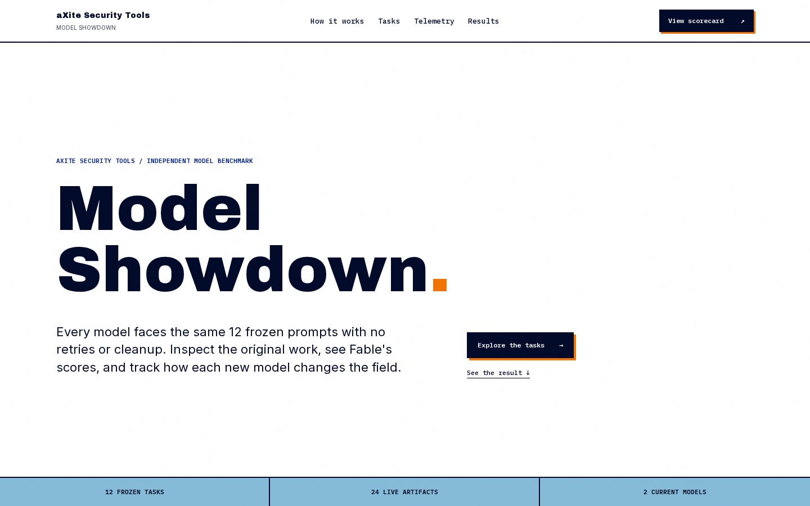

# Model Showdown

A living large language model benchmark from [aXite Security Tools](https://www.axite-securitytools.com/). Every model receives the same 12 frozen tasks, one attempt per task, with no human cleanup. The site preserves the original artifacts, measured runtime telemetry, and Fable's scores and written verdicts.

[View the live benchmark](https://model-arena-rho.vercel.app) | [Browse the tasks](https://model-arena-rho.vercel.app/tasks/) | [See the results](https://model-arena-rho.vercel.app/standings/)



## What this repository contains

- 12 fixed prompts spanning visual design, frontend development, systems programming, networking, and code review
- 24 original artifacts from two locally served models
- Per-task scores, verdicts, and supporting evidence from Fable
- Request timing, token usage, tool-call, and throughput telemetry from the benchmark runs
- A static Next.js application that can be deployed directly to Vercel

The benchmark is designed to grow. A future model can run the same prompt suite and join the existing record without changing the application components.

## Current field

| Model | Serving configuration | Run date | Fable average | Task wins |
| --- | --- | --- | ---: | ---: |
| MiniMax M2.7 | AWQ 4-bit, 196K context | July 17, 2026 | 6.6 | 3 |
| DeepSeek V4 Flash | 500K context, MTP speculative decoding, maximum reasoning effort | July 17, 2026 | 7.7 | 8 |

Task wins count only outright wins. Tied tasks do not count toward either model.

## Benchmark method

1. Freeze the task prompts before testing a model.
2. Run each task once in a fresh `opencode run --auto` session against the cluster's OpenAI-compatible endpoint.
3. Allow the model to use shell and file tools, including compiling or testing its own work.
4. Preserve the generated artifacts exactly as submitted, including defects.
5. Record timings, tokens, and tool calls through a transparent logging proxy.
6. Publish Fable's score, verdict, and evidence for every artifact.

Fable is the Claude agent that operates the benchmark cluster. Scores represent this fixed evaluation suite and should not be interpreted as a universal model ranking.

## Task suite

| Case | Task | Category |
| ---: | --- | --- |
| 01 | Pelican on a bicycle | SVG illustration |
| 02 | Self-portrait | Animated SVG |
| 03 | Amsterdam canal at night | Pure CSS art |
| 04 | PacketPerfume | Landing page |
| 05 | Packet Run | Canvas game |
| 06 | 64KB demoscene | WebGL and audio |
| 07 | ASCII aquarium | C++17 terminal application |
| 08 | Lock-free ring buffer | C++20 concurrency |
| 09 | Bug hunt | Code review |
| 10 | epoll chat server | Linux networking |
| 11 | HTTP quine server | C++ networking |
| 12 | The flamingo lineman | Novel SVG |

## Application pages

| Route | Purpose |
| --- | --- |
| `/` | Benchmark method, current models, aggregate result, and visual comparison |
| `/tasks/` | Searchable catalog of all benchmark tasks and scores |
| `/task/[id]/` | Original artifacts, execution metadata, Fable scores, verdicts, and evidence |
| `/telemetry/` | Measured performance and token telemetry |
| `/standings/` | Aggregate results, task wins, and the complete score matrix |

## Technology

- Next.js 15 with the App Router and static export
- React 19
- Framer Motion
- Plain CSS with responsive desktop and mobile layouts
- No database, API server, or runtime environment variables

## Run locally

Requirements:

- Node.js 20 or newer
- npm 10 or newer

```bash
git clone https://github.com/thecr7guy2/model-arena.git
cd model-arena
npm ci
npm run dev
```

Open [http://localhost:3000](http://localhost:3000).

## Available scripts

| Command | Description |
| --- | --- |
| `npm run dev` | Start the Next.js development server |
| `npm run build` | Create the production static export in `out/` |
| `npm start` | Serve the exported `out/` directory locally |

## Deploy

The project uses `output: "export"` in `next.config.mjs`. Vercel can deploy the repository with its standard Next.js settings. No secrets or environment variables are required.

For another static host:

```bash
npm ci
npm run build
```

Publish the generated `out/` directory.

## Project structure

```text
app/                 Routes, metadata, and global styles
components/          Benchmark views and interactive presentation components
lib/data.js          Models, tasks, scores, verdicts, evidence, and telemetry
public/artifacts/    Original model outputs grouped by model and task
public/shots/        Browser captures used by the catalog and comparisons
docs/                Repository documentation assets
```

## Add another model

1. Run all 12 frozen prompts against the new model.
2. Store its outputs under `public/artifacts/<model-id>/<task-id>/`.
3. Store visual captures under `public/shots/<model-id>/`.
4. Add the model configuration to `MODELS` in `lib/data.js`.
5. Extend every task's `artifacts`, `scores`, `verdicts`, `evidence`, `meta`, and `shots` fields.
6. Run `npm run build` and verify the home page, task catalog, task details, telemetry, and results pages.

The interface derives its model columns and comparison views from the data, so a new model does not require component-level changes.

## Data ownership

The benchmark artifacts, measurements, and site are maintained by aXite Security Tools. The repository currently does not declare an open-source license.
